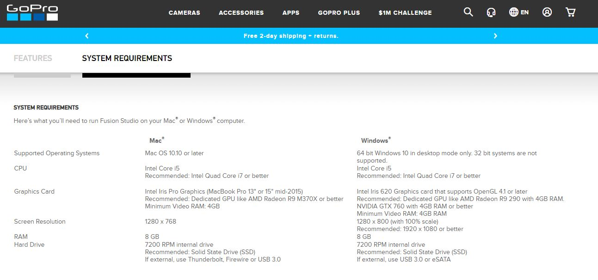

# Technical Assignment - Software Engineer, Image Acquisition 
#### 24th September 2018

## OVERVIEW
Clark Street Coffee, a Chicago-based stealth brand of dockless coffee shops, has engaged Mapillary to accelerate street-level imagery coverage in strategic markets around the globe. They will use imagery captured by the GoPro Fusion to locate potential street benches where they can perch their battery powered espresso machines and disrupt the coffee industry. They have recently returned from the street and are attempting to process and upload their imagery. We will use their imagery sample to script out tools that will result in 360 degree imagery that can be uploaded to Mapillary.

## GOALS

1. Install GoPro Fusion Studio 1.3
2. Stitch and process the images with GoPro Fusion 1.3
3. Process the stitched imagery and maintain embedded GPS and location sensor data in a machine readable format.
4. Apply acceptance tests which validate the code and methods resulting in command line tools which will stitch (Step 1), process (Step 2), and upload public imagery to Mapillary

## SPECIFICATIONS
The following documentation was produced using a Windows x64 machine with an Intel i5 and 8GB of RAM.

## MILESTONES

### 1. Install GoPro Fusion 1.3

1.1 Copy your files on the two SD Cards to your PC. The Fusion can be connected directly to your PC or Mac using the USB-C cable. However, copying the files to your computer directly is faster and will speed up your stitching and rendering. Save the files on your Desktop for further easier processing. Save the files in 2 separate folders, FRONT for the front camera and BACK for the back camera. The images used for this tutorial will be saved under Desktop\gopro_fusion\FRONT and Desktop\gopro_fusion\BACK.

1.2 Go to the Gopro website to download the latest version of the software.


In this document, the version with which the image processing will be executed will be GoPro Fusion Studio 1.3. Verify that your computer satisfies the requirements for the GoPro Fusion Studio Software 1.3. Those requirements can be found on the official GoPro website provided above. Once on the page of the download provided above, scroll down until the Features section and click System Requirements next to it.



Go to your Downloads file and open the .exe file.
Once on the SetUp, click Next.
Accept the License Agreement.
Chose the file location in which you want the software to be stored.


Chose the components you want to download. Here, we only want to stitch our 180° images. To save some system space, unselect the GoPro VR Player.
The installation might take a few minutes. When it is over, click Finish.

**You have successfully installed GoPro Fusion Studio 1.3 !**

### 2. Stitch the images with GoPro Fusion 1.3

#### 2.1 Launch GoPro Fusion 1.3

Launch it through the Windows PowerShell. In order to open the PowerShell, press Windows + X and chose PowerShell.
Cap PowerShell

#### 2.2 Go to the directory where GoPro Fusion 1.3 was installed. 
```cd C:\Program Files\GoPro\Fusion Studio 1.3```

#### 2.3 Stitching
We will go through the command detailed options of Fusion Studio 1.3 to stitch and process one image in 2.3.1. **If you want to access the final command line to stitch and process your whole file, jump to 2.3.2.** Do not execute the commands of the section 3.1 on their own, since alone they won’t produce the expected result.

##### 2.3.1 Options details 
Launch Fusion Studio 1.3. The executable file might have a different name depending of the version you downloaded. 
```./FusionStudio_x64.exe```

Then, use the ```--back``` command to specify the path to the BACK image and ```--front``` to specify the path to the FRONT image.

```-- back path\to\the\back\image\GB000000.jpg```
```-- front path\to\the\front\image\GF000000.jpg```

Use the ```-o``` option to specify the directory (it must be an existing directory) and the file name of your output images. 

```-o path\to\the\output\image\outputImage.jpg```

Use the ```-p``` option to specify the type of stitching you want. We will chose the equirectangular projection.

```-p 0```

Use the ```--pc``` option to ensure that the parallax compensation stays enabled.

```--pc 1```

Then we will export the metadata containing the GPS and location sensor data in the GPMFdata.JSON file. The software only allow the exportation of this data in the JSON format.

```--exportGpmf -o path\to\the\metadata\GPMFdata.JSON```

If we put all those commands together, we can stitch and process one image.

```FusionStudio_x64.exe --back path\to\the\back\image\GB000000.jpg -- front path\to\the\front\image\GF000000.jpg -o path\to\the\output\image\outputimage.jpg -p 0 --pc 1 --exportGpmf -o path\to\the\metadata\GPMFdata.JSON```

Since the software does not allow one to process a whole directory, we will use a Windows command line to apply the process to our whole GoPro image directory. We will use the fact that GoPro uses a predefined name for its images : GB0XXXXX.jpg.

```firstImage..lastImage |  % { $_ ; sleep 10}```

In this syntax, the system will successively replace ```$_``` by ```firstImage``` until ```lastImage```.
The ```sleep 10``` command allows the time to GoPro Fusion Studio to process the imagery without crashing. Depending on your computer, you can try a ```sleep 5``` for the commandline to be executed faster. However, Fusion Studio 1.3 could crash. If you get a Crash report as shown in the following capture, you should increment the ```sleep time```.
Cap Crash

##### 2.3.2 Final command line

```firstImage..lastImage |  % { ./FusionStudio_x64.exe -- back path\to\the\back\image\GB0$_.jpg --front path\to\the\front\image\GF0$_.jpg -o path\to\the\output\image\outputImage$_.jpg -p 0 --pc 1; sleep 10}```

Here is an example, for 42 images, going from G055000 to G055041 to stitch the images (equirectangular) with parallax compensation enabled : 

```55000..55041 | % { ./FusionStudio_x64.exe --back C:\Users\Anais\Desktop\gopro_fusion\BACK\DCIM\103GBACK\GB0$_.JPG --front C:\Users\Anais\Desktop\gopro_fusion\FRONT\DCIM\103GFRNT\GF0$_.jpg -o C:\Users\Anais\Desktop\gopro_fusion\Results\stitched$_.jpg -p 0 --pc 1; sleep 10}```

#### 3. Process the images with GoPro Fusion 1.3 to extract the GPS and location data in a machine readable format
Please make sure that you have completed 2.1 and 2.2 step prior to 3.
GoPro uses the the GPMF format to store location and GPS data. We will work on extracting this data.

##### 3.3.1 Options details
The software shows an error if the data is collected at the same time that the image is stitched. You have to do the previous operation again and add the line concerning the GPMF data detailed in section 2.3.1.

```firstImage..lastImage |  % { ./FusionStudio_x64.exe -- back path\to\the\back\image\GB0$_.jpg --front path\to\the\front\image\GF0$_.jpg -o path\to\the\output\image\outputImage$_.jpg -p 0 --pc 1 --exportGpmf -o path\to\the\metadata\GPMFdata$_.JSON; sleep 15}```

##### 3.3.2 Final command line
Here is an example, for 42 images, going from G055000 to G055041 to collect the GPS data in a JSON format :

```firstImage..lastImage |  % { ./FusionStudio_x64.exe -- back path\to\the\back\image\GB0$_.jpg --front path\to\the\front\image\GF0$_.jpg -o path\to\the\output\image\outputImage$_.jpg -p 0 --pc 1 --exportGpmf -o path\to\the\metadata\GPMFdata$_.JSON; sleep 15}```

#### 4. Apply acceptance test and upload your imagery to Mapillary
Follow the instructions provided on the Mapillary Github page to configure your machine to run mapillary tools. Once it is configured, run 

```C:\python27\python.exe C:\python27\Scripts\mapillary_tools process_and_upload --import_path Path\to\your\soon\to\be\processed\and\uploaded\images --user_name “your username”```

Warning : the path to your python.exe or to the mapillary tools might be different on your system depending on your installation. In our example, the path is the following :

```C:\python27\python.exe C:\python27\Scripts\mapillary_tools process_and_upload --import_path C:\Users\Anais\Desktop\gopro_fusion\Results --user_name afaggiano```

##### Your images are successfully uploaded to Mapillary !

You can look into your “Results” folder. You will find a Mapillary folder. Open it, click on one image and verify that all your process and uploading are a success : 


The failed user_process is detailed in the Details.md document.
You can also verify your uploading going on https://www.mapillary.com/. Log in using your Mapillary credentials and click on your picture the right-hand side. Click “Uploads” and you will see your uploaded images. 


